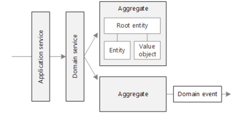

# DDD (Domain Driven Deign) 이란?
* 복잡한 비즈니스 로직을 도메인 모델 중심으로 설계하는 접근 방식

### 핵심 개념


(출처: [DDD 개념 관계도](https://learn.microsoft.com/ko-kr/azure/architecture/microservices/model/tactical-ddd))

| 개념           | 설명                                             |
| ------------ | ---------------------------------------------- |
| 도메인(Domain)  | 해결하고자 하는 문제 영역 (예: 계약, 고객, 주문 등)               |
| 엔티티(Entity)  | 고유한 식별자를 가지는 객체 (예: `Contract`, `Customer`)    |
| 밸류 오브젝트(Value Object) | 값 자체로 의미를 가지며 불변인 객체 (예: `Money`, `DateRange`) |
| 애그리거트(Aggregate) | 트랜잭션 일관성을 유지해야 하는 객체 묶음 (루트 엔티티 포함)            |
| 리포지토리(Repository) | 도메인 객체의 저장소 역할을 하는 인터페이스                       |
| 서비스(Service) | 복잡한 도메인 로직을 구현하는 도메인/애플리케이션 서비스 계층             |
| 도메인 이벤트(Domain Event) | 상태 변화나 비즈니스 이벤트를 표현                            |

### DDD에서의 Entity?
* 고유 ID로 식별되며, 상태가 변해도 같은 객체로 취급하는 도메인 객체
* jpa 에서의 entity와 헷갈릴 수 있지만, 전혀 다름 -> 둘은 혼합해도 되지만, 명확히 나누는 것이 이상적

### DDD에서의 Service?
* 도메인 서비스와 애플리케이션 서비스 두 종류가 존재 -> 둘 다 비즈니스 로직을 다루기 때문에 처음엔 헷갈릴 수 있음
* 도메인 서비스
    * 하나의 엔티티로 처리하기 애매한 비즈니스 규칙을 담당
    * 여러 도메인 객체(Entity, Value Object)가 연관된 로직
    * 예로, "고객은 계약을 하나만 가질 수 있다"
    * → Customer와 Contract 모두 연관되므로 둘 중 어디에도 넣기 애매한 규칙

* 애플리케이션 서비스
    * 유스케이스(비즈니스 흐름 전체)를 구현하는 계층
    * 도메인 객체 조립, 도메인 서비스 호출, 저장 등을 조합
    * 예로, 신규 계약 등록 → 입력 검증 → 도메인 검증 → 저장

* 결론적으로
* 도메인 서비스는 순수한 도메인 규칙을 표현
* 애플리케이션 서비스는 그것을 묶어 사용자 행동을 구현

### Aggregate 와 Aggregate Root
* Aggregate
    * 도메인 객체(Entity, Value Object)의 묶음
    * 트랜잭션 단위로 일관성을 유지해야 하는 범위
    * 외부에서는 내부 구성요소에 직접 접근할 수 없음

* Aggregate Root
    * Aggregate의 진입점이 되는 대표 Entity
    * 외부는 반드시 이 루트를 통해서만 Aggregate를 수정/조회
    * Repository도 항상 루트만 저장/조회한다

* 헷갈렸던 것은, Root가 Aggregate보다 더 작아보이는데, 이게 대표 역할을 한다는 게 좀 헷갈렸음
    * 결론은 Root는 Aggregate의 일부이지만, 그 전체를 대표하는 역할
    * 외부에서는 오직 루트를 통해 Aggregate 전체를 간접적으로 다룬다

# 도메인 모델 설계
### 시나리오
* 고객은 계약을 1건만 가질 수 있다.
* 계약은 시작일-종료일의 기간을 가진다.
* 계약은 CANCEL 될 수 있다.
* 기간이 지난 계약은 취소할 수 없다.
* 계약 생성 전, 고객이 존재해야 한다.
* 신규 계약 생성 시,
    * 고객이 존재하는지 확인
    * 기존 계약있는지 확인
    * 계약을 생성
    * 계약의 상태를 ACTIVE로 설정

### 도메인 구성 요소 매핑
```text
Aggregate: Customer  
  └─ Aggregate Root: Customer  
        └─ Value Object: PhoneNumber 
        
Aggregate: Contract  
  └─ Aggregate Root: Contract  
        ├─ Value Object: ContractPeriod
        └─ Entity: ContractHistory  
```

### 책임 매핑
| 규칙                     | 책임 계층                                | 판단 근거 설명                                        |
| ---------------------- | ------------------------------------ |-------------------------------------------------|
| 고객은 계약을 1건만 가질 수 있다    | `ContractDomainService`              | 고객, 계약이 필요 -> 단일 엔티티 책임을 넘음 & 흐름 x -> 도메인 서비스   |
| 고객 존재 여부 확인            | `ContractApplicationService`         | 고객 단순 조회 & 실행 흐름 제어의 일부 -> 애플리케이션 서비스           |
| 기간이 지난 계약은 취소할 수 없다    | `Contract` (Entity)                  | 도메인 내부 상태만으로 결정 -> 계약 엔티티                       |
| 계약 생성 및 상태를 ACTIVE로 설정 | `Contract` + `ContractDomainService` | 계약 객체 생성 & 상태 active 설정 -> 계약 엔티, 기존 계약유무 확인 -> 도메인 서비스 |
| 계약 저장                  | `ContractRepository`                 | 영속성 관련 처리 -> Repository                         |

# 코드 구현 (feat. jmolecules)
### jmolecules
* 아키텍처 개념을 명확하게 표현하여 코드의 명확성과 유지 관리성을 향상시키는 라이브러리

### 의존성 추가
```kotlin
implementation("org.jmolecules:jmolecules-ddd:1.9.0")
```

### 주요 어노테이션
* 도메인 기반 디자인(DDD): @Entity, @ValueObject, @Repository , @AggregateRoot
* CQRS 아키텍처: @Command , @CommandHandler , @QueryModel
* 계층형 아키텍처: @DomainLayer , @ApplicationLayer , @InfrastructureLayer
