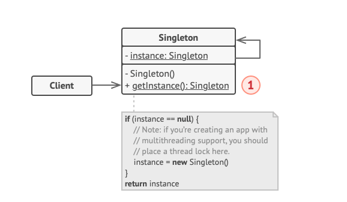
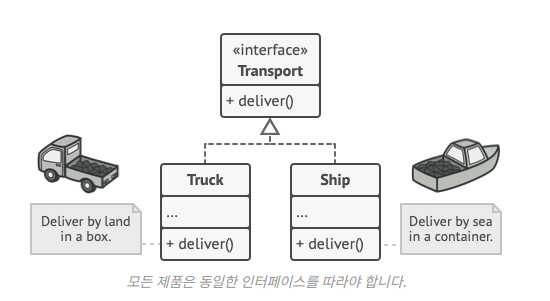
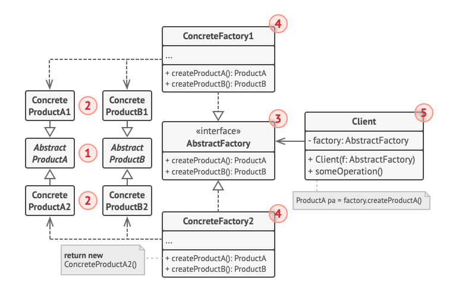

## Singleton Pattern
* 하나의 클래스에 대해 하나의 인스턴스만 가지는 것
* 이 인스턴스에 대해 전역으로 접근할 수 있도록 제공

### 구조

* 인스턴스를 저장할 필드를 클래스 내부에 선언   
-> 이 필드는 외부에서 접근할 수 있도록 static으로, 외부에서 수정되지 않도록 private final로 정의된다.
* Singletone 타입의 instance 필드를 하나 두고 (전역에서 접근할 수 있도록 static, 수정할 수 없도록 final로 정의)
* 생성자를 private으로 제한하여 외부에서 직접 new 키워드로 객체를 생성하지 못하게 한다. 
* 전역 접근 메서드 (getInstance)를 통해 인스턴스를 반환   
-> 이 메서드는 최초 호출 시 인스턴스를 생성하고, 이후에는 동일한 인스턴스를 반환한다.

이렇게 구성함으로써, 외부에서는 해당 클래스를 생성할 수 없고, 오직 getInstance()를 통해서만 접근이 가능하다.   
즉, 전역적으로 하나의 인스턴스만 존재하는 구조가 보장된다.


### 실행 결과
> Task :SingletonExample.main()
org.example.Singleton@2ff4acd0, org.example.Singleton@2ff4acd0, org.example.Singleton@2ff4acd0

출력된 결과를 보면, getInstance()를 여러 번 호출하고 각각 다른 변수에 할당했음에도 불구하고,
모든 인스턴스의 메모리 주소가 동일하다.

이를 통해 Singleton 패턴이 하나의 인스턴스만을 생성하고, 이를 공유한다는 특성이 제대로 동작하고 있음을 알 수 있다.


## Factory Method Pattern
* 객체를 생성하는 역할을 Factory 에게 위임하는 패턴
* 어떤 객체를 만들지는 Factory가 결정하고, 클라이언트는 공통 인터페이스만 사용

### 구조

* 위 구조에서 Truck과 Ship은 모두 Transport라는 공통 인터페이스를 구현하고 있다.
* 즉, 이들은 모두 "운송 수단"이라는 추상적인 특성을 공유한다.
* 클라이언트는 객체를 생성할 때 new Truck() 또는 new Ship()처럼 구체 클래스에 의존하는 것이 아니라,
* 팩토리 메서드를 호출하여 Transport 인터페이스 타입으로 객체를 생성하게 된다.
* 즉, 객체 생성의 책임을 팩토리에게 위임함으로써, 새로운 타입이 추가되더라도 클라이언트 코드는 변경 없이 동작할 수 있다.

### 코드 구성 요소 & 역할
| 요소                         | 역할                     |
|----------------------------|------------------------|
| `createTransport()`        | 팩토리 메서드 (추상 메서드)       |
| `Logistics`                | Creator (팩토리 메서드를 선언하는 추상 클래스) |
| `RoadLogistics`, `SeaLogistics` | ConcreteCreator (팩토리 메서드를 구현) |
| `Transport`                | Product 인터페이스          |
| `Truck`, `Ship`            | ConcreteProduct (실제 생성될 객체들) |


## Abstract Factory Pattern
* Factory Method Pattern과 유사하지만, 더 확장된 개념으로 느껴졌다.
* 서로 연관된 여러 객체들(제품군)을 팩토리가 한 번에 생성하고, 클라이언트는 추상화된 인터페이스를 통해 사용할 수 있도록 돕는 패턴이다.

### Factory Method Pattern vs Abstract Factory Pattern
| 항목     | Factory Method Pattern                                           | Abstract Factory Pattern                                              |
|----------|------------------------------------------------------------------|-----------------------------------------------------------------------|
| 목적     | 단일 객체(Product)를 생성할 책임을 서브클래스에게 위임              | 관련된 객체군(Product family)을 생성할 책임을 서브팩토리에 위임         |
| 구성     | Creator 클래스가 하나의 제품을 생성하는 메서드(`createProduct()`)를 가짐 | 여러 제품을 생성하는 팩토리 인터페이스 (`createChair()`, `createSofa()` 등) |
| 유연성   | 하나의 제품 계열을 다룰 때 적합                                     | 여러 제품이 함께 구성되어야 할 때 적합                                 |


### 구조
 
* 각 제품군은 공통 인터페이스를 따르고, 각 제품군에 맞는 클래스는 인터페이스를 구현한다.
* 팩토리는 제품군별로 createChair(), createSofa() 등 메서드를 제공한다.
* 클라이언트는 구현체 클래스가 아닌 인터페이스를 통해 객체를 사용한다.
* 즉, 팩토리 하나로 관련된 제품군 전체를 일관되게 생성할 수 있고,
* 제품군을 통째로 교체하더라도 클라이언트 코드는 영향을 받지 않는다.

### 코드 구성 요소 & 역할
| 요소                                           | 역할                    |
|------------------------------------------------|-----------------------|
| `FurnitureFactory`                             | 추상 팩토리 (제품 생성 인터페이스)  |
| `ModernFurnitureFactory`, `VictorianFurnitureFactory` | 구현체 팩토리   |
| `Chair`, `Sofa`                                | 제품 인터페이스 (공통 기능 정의)   |
| `ModernChair`, `VictorianChair`, `ModernSofa`, `VictorianSofa` | 구현체 제품 클래스            |


## Builder Pattern
* 복잡한 객체를 단계별로 생성할 수 있도록 도와주는 패턴

### Director 란?
* 빌더 패턴이라고 하면, 대부분 다음과 같은 형태를 떠올린다.
```java
    UserDto user = UserDto.builder()
        .name("최소현")
        .age(28)
        .email("sohyun@example.com")
        .build();
```

* 나 역시 DTO나 VO 객체를 만들 때 빌더 패턴을 자주 썼다.
* 특히 Lombok의 @Builder를 쓰면 간결하고 명확하게 객체를 만들 수 있어서 자주 활용했다.
* 하지만, GoF에서 말하는 빌더 패턴에는 Builder와 함께 Director라는 구성요소가 등장한다.
  * Builder는 객체를 "어떻게 만들 것인지"를 정의하고,
  * Director는 Builder를 조립하는 순서를 정하는 역할을 맡는다.

```java
    public class BuilderExample {
        public static void main(String[] args) {
            Director director = new Director();
            CarBuilder builder = new CarBuilder();
    
            director.constructSportsCar(builder);
            Car car = builder.getProduct();
    
            System.out.println(car);
        }
    }

    class Director {
        public void constructSportsCar(Builder builder) {
            builder.reset();
            builder.setSeats(2);
            builder.setEngine("V8");
            builder.setGPS("Enabled");
        }
    }
```
* 위와 같이 순서를 강제하는 director 클래스를 만들고
* Builder를 주입한 후, director 가 정의한 순서대로 객체 생성과정을 수행하면
* 객체생성 절차의 일관성을 유지하고, 클라이언트는 생성 로직을 몰라도 객체를 만들수있다.

### Builder vs GoF Builder Pattern
* 평소에 자주 쓰는 Lombok의 @Builder나 DTO 만들 때 쓰는 방식은 사실 GoF에서 말한 전통적인 Builder 패턴과는 다르다.
* Lombok의 빌더는 주로 객체의 필드를 자유롭게 설정해서, build()로 마무리 짓는 형태다.
* 반면 GoF에서 말하는 빌더 패턴은 좀 더 구조적이다.
* Builder는 객체의 부품들을 어떻게 설정할지에 대한 책임만 갖고 있고,
* Director가 전체 조립 순서를 관리한다.
* 아무튼, 둘 다 Builder란 이름을 쓰지만, 목적도 쓰임새도 조금 다르다.
