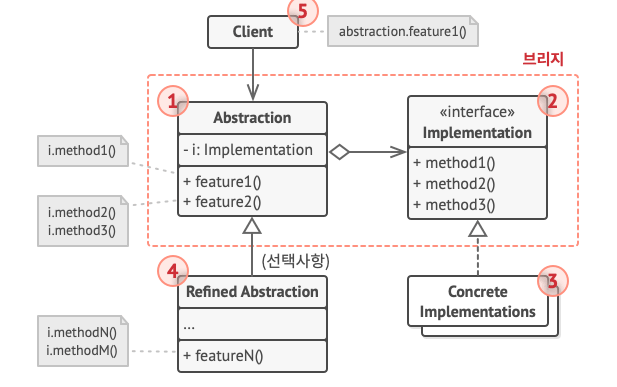

## Adapter Pattern
* 서로 다른 인터페이스를 가진 클래스들을 연결하기 위해 중간에 어댑터를 두는 패턴
* 기존 클래스를 수정하지 않고 새로운 코드와 호환할 수 있다

### 코드 구성 요소 & 역할

| 요소        | 역할                                              |
|-------------|---------------------------------------------------|
| `Target`    | 클라이언트가 기대하는 인터페이스                          |
| `Adaptee`   | 기존 클래스 (인터페이스가 다름)                           |
| `Adapter`   | Target을 구현하고 내부에서 Adaptee를 호출하여 변환 역할 수행 |
| `Client`    | Target을 사용하며, Adapter를 통해 Adaptee를 간접 사용      |

```java
class SquarePegAdapter extends RoundPeg {
    private final SquarePeg peg;

    SquarePegAdapter(SquarePeg peg) {
        super(0); 
        this.peg = peg;
    }

    @Override
    int getRadius() {
         return (int) (peg.getWidth() * Math.sqrt(2) / 2);
    }
}
```
* 기존 시스템은 RoundPeg라는 클래스(원형 못)를 기준으로 설계되어 있고
* SquarePeg(네모 못)를 끼워야 하는 상황이 생겼 을 때,
* 이 어댑터 클래스는 SquarePeg를 감싸고 있으며,
* 기존 시스템이 기대하는 getRadius() 메서드를 간접적으로 계산해 제공한다.
* 이렇게 하면 SquarePeg 객체를 RoundPeg처럼 사용할 수 있게 된다!
---

## Bridge Pattern
* 기능 계층(Abstraction)과 구현 계층(Implementor)을 분리하여 서로 독립적으로 확장할 수 있는 구조
* 기능과 구현을 조합해서 사용하되, 두 계층을 따로 관리할 수 있으므로 클래스 수가 불필요하게 늘어나지 않음
* 아래 그림을 보자.

  * “모양”과 “색상”이라는 두 개의 독립적인 계층이 있다고 할 때,
  * 각각을 분리해서 구현하면 모든 조합(빨간 원, 파란 원, 빨간 사각형, 파란 사각형)에 대한 클래스를 다 만들 필요 없이,
  * 모양 클래스에서 색상 구현체를 참조하는 방식으로 조합 가능함

### 구조

### 코드 구성 요소 & 역할
| 요소               | 클래스명          | 역할                                                    |
|------------------|---------------|---------------------------------------------------------|
| Abstraction      | `Remote`      | 기능 계층의 추상화. 디바이스 제어 메서드 정의           |
| RefinedAbstraction | - (패스...)     | 기능 계층 확장 클래스          |
| Implementor      | `Device`      | 구현 계층 인터페이스. 실제 기기 조작 인터페이스 정의    |
| ConcreteImplementor | `Radio`, `TV` | 실제 기기 구현 |

---

## Composite Pattern
* 객체들을 트리 구조로 구성하고, 공통 인터페이스(Component)를 통해  
  부분(Leaf)과 전체(Composite)를 동일한 타입으로 다룰 수 있게 해주는 패턴   
-> 이를 통해 구조를 단순화하고, 클라이언트 코드의 복잡도를 줄임

### 구조


### 코드 구성 요소 & 역할

| 구성요소     | 클래스명           | 설명                                            |
|--------------|--------------------|-------------------------------------------------|
| Component    | `Graphic`          | 공통 인터페이스                                  |
| Leaf         | `Dot`, `Circle`    | 실제 기능 수행, 복잡한 구조 없음                 |
| Composite    | `CompoundGraphic`  | 자식 리스트를 보유하며 재귀적으로 위임 처리     |
| Client       | `ImageEditor`      | 구조를 몰라도 일괄적으로 작업 수행 가능 | 

* Graphic 이라는 공통 인터페이스를 통해 Dot, Circle, CompoundGraphic을 동일한 타입으로 다룬다.
* CompoundGraphic은 Graphic 타입의 자식들을 리스트 형태로 가지고
* 내부 요소가 Dot이든, Circle이든, 또 다른 CompoundGraphic이든 관계없이
* move, draw를 재귀적으로 호출할 수 있다.

* 즉, ImageEditor는 전체 구조가 leaf인지 composite인지 신경 쓰지 않고
* Graphic 타입으로 요소를 추가, 그룹화, 이동, 그리기를 수행한다.

## Decorator Pattern
* 기능 확장시 객체의 결합을 통해 런타임에 동적으로 추가할 수 있도록 해주는 디자인 패턴

### 예시
* 위 말로는 잘 이해가 안되므로,, 간략한 예시로 알아보겠다.
* 카페에서 커피를 주문한다고 할 때,
  * 기본 커피 (+ 우유, 시럽, 휘핑, 샷 추가) 등등 다양한 옵션을 추가할 수 있다고 하자.
  * 이때 단순히 구현해보면 아래와 같다.

#### before
  ```java
  class Coffee {
    public int cost() {
        return 3000; // 기본 아메리카노
    }
  } 
  
  class MilkCoffee extends Coffee {
    @Override
    public int cost() {
        return super.cost() + 500;
    }
  }

  class SyrupMilkCoffee extends Coffee {
    @Override
    public int cost() {
        return super.cost() + 500 + 300;
    }
  }
  ```
| 조합             | 필요한 클래스            |
|------------------|--------------------------|
| 우유             | MilkCoffee               |
| 시럽 + 우유      | SyrupMilkCoffee          |
| 휘핑 + 샷 + 시럽 | WhipShotSyrupCoffee      |

* 기능을 조합하려고 상속만 사용하면, 2^n - 1개의 모든 조합 클래스를 직접 만들어야 한다. (기능 추가나 제거도 유연x)

#### after
```java
// 상위 인터페이스
interface Beverage {
  int cost();
}

// 기본 커피
class Coffee implements Beverage {
  public int cost() {
    return 3000;
  }
}

// 공통 데코레이터 추상 클래스
abstract class AddOnDecorator implements Beverage {
  protected Beverage base;

  public AddOnDecorator(Beverage base) {
    this.base = base;
  }
}

// 우유 추가
class Milk extends AddOnDecorator {
  public Milk(Beverage base) {
    super(base);
  }

  public int cost() {
    return base.cost() + 500;
  }
}

// 시럽 추가
class Syrup extends AddOnDecorator {
  public Syrup(Beverage base) {
    super(base);
  }

  public int cost() {
    return base.cost() + 300;
  }
}

public class DecoratorExample {
  public static void main(String[] args) {
    Beverage coffee = new Coffee();       // 기본 커피 3000
    coffee = new Milk(coffee);               // + 우유 500 → 3500
    coffee = new Syrup(coffee);              // + 시럽 300 → 3800

    System.out.println("최종 가격: " + coffee.cost() + "원");
  }
}

```
* 데코레이터 패턴은 모든 기능 클래스가 같은 상위 인터페이스를 구현하고
* 실제 기능은 런타임에 외부에서 주입하여 객체를 조립하듯 감싸게 된다!

#### 실행 결과
```text
  >> Task :DecoratorExample.main()
  >> Syrup cost() method call, +300
  >> Milk cost() method call, +500
  >> Coffee cost() method call, 3000
  Total Cost: 3800
```
* 실제 실행 결과를 보면, 위와 같다.
* 객체를 감싸면서 기능을 누적하므로,
* 내부적으로 base.cost()를 호출해 안쪽 객체부터 계산되는 것을 알 수 있다. (로그는 메서드 진입 시점이라 반대임)

### 구조

* 구조와 코드를 대입해보면, 다음과 같다.

| 구성 요소               | 설명                                                      | 코드         |
|------------------------|-----------------------------------------------------------|------------------------------|
| Component              | 공통 인터페이스 또는 추상 클래스                          | `Beverage` (interface)       |
| ConcreteComponent      | 실제 기능을 가진 기본 객체                                 | `Coffee`     |
| Decorator (Base Decorator) | Component 인터페이스를 구현하고, 내부에 Component를 포함하는 클래스 | `AddOnDecorator` (abstract)  |
| ConcreteDecorator      | 데코레이터 역할 + 실제 기능을 덧붙이는 클래스              | `Milk`, `Syrup` 등           |

* 가장 상위 인터페이스(component)를 둔다.
  * 이 인터페이스는 공통 기능을 정의한다.
* ConcreteComponent는 이 인터페이스를 구현하며, 가장 베이스가 되는 기본 기능을 제공한다.
* BaseDecorator는 같은 인터페이스(component)를 구현하고, 내부에 원본 객체(component)를 필드로 포함한다.
* ConcreteDecorator는 BaseDecorator를 확장하고, 실제로 부가기능을 구현한다.
* Client는 필요한 기능을 동적으로 조합해서 데코레이터 체인을 구성하게 된다. -> 기능 확장
